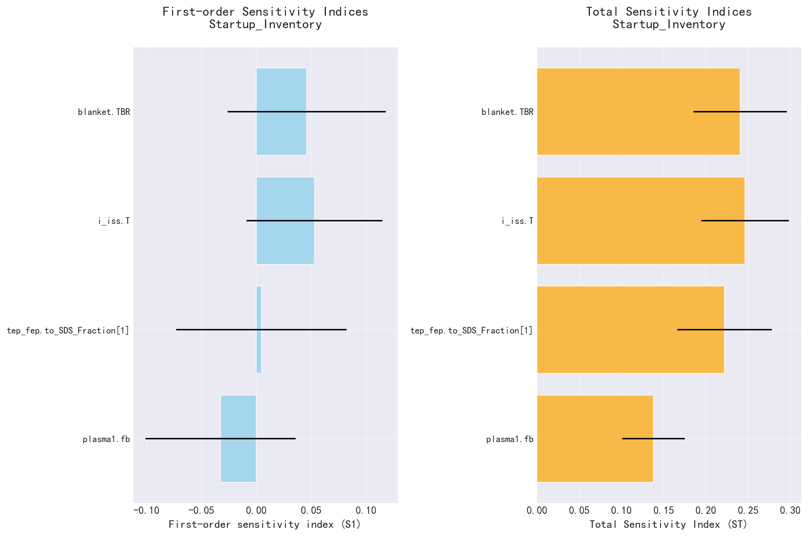
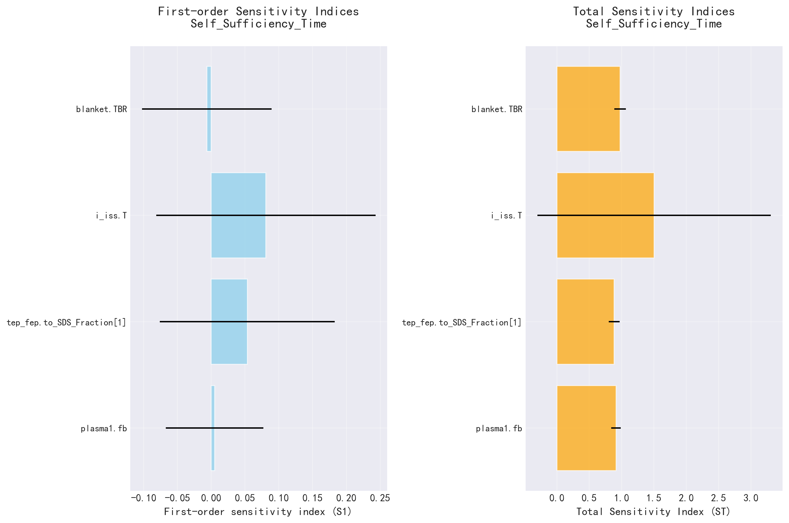
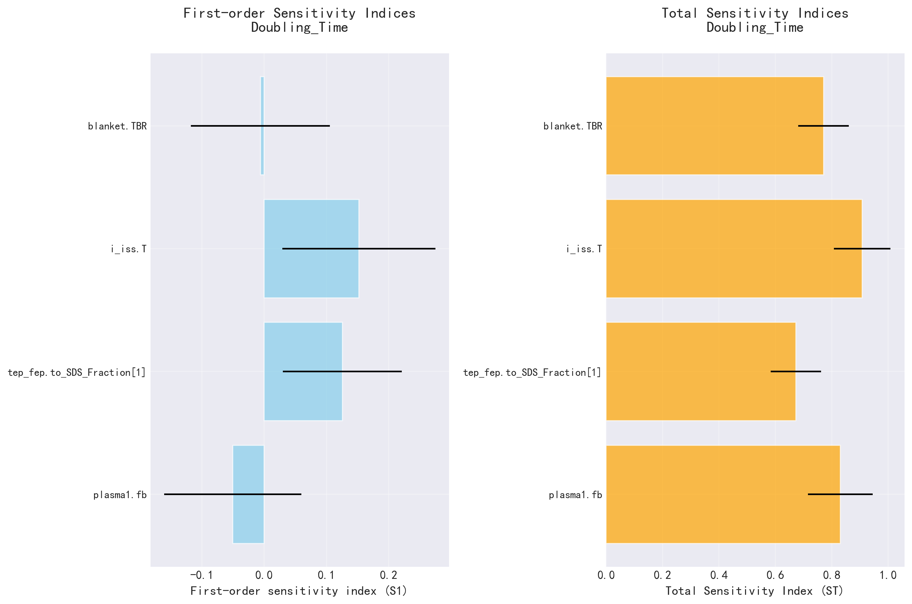

# SALib 敏感性分析报告

生成时间: 2025-10-13 11:00:02.558093

## 分析参数

- **plasma1.fb**: [0.0200, 0.2000]
- **tep_fep.to_SDS_Fraction[1]**: [0.1000, 0.9900]
- **i_iss.T**: [4.0000, 12.0000]
- **blanket.TBR**: [1.0500, 1.2500]

## Startup_Inventory 敏感性分析结果

### Sobol敏感性指数

| 参数 | S1 (一阶) | ST (总) | S1置信区间 | ST置信区间 |
|------|----------|---------|------------|------------|
| plasma1.fb | -0.0325 | 0.1379 | ±0.0684 | ±0.0370 |
| tep_fep.to_SDS_Fraction[1] | 0.0047 | 0.2221 | ±0.0776 | ±0.0560 |
| i_iss.T | 0.0530 | 0.2462 | ±0.0620 | ±0.0519 |
| blanket.TBR | 0.0459 | 0.2406 | ±0.0721 | ±0.0553 |



## Self_Sufficiency_Time 敏感性分析结果

### Sobol敏感性指数

| 参数 | S1 (一阶) | ST (总) | S1置信区间 | ST置信区间 |
|------|----------|---------|------------|------------|
| plasma1.fb | 0.0051 | 0.9128 | ±0.0722 | ±0.0739 |
| tep_fep.to_SDS_Fraction[1] | 0.0535 | 0.8851 | ±0.1293 | ±0.0827 |
| i_iss.T | 0.0809 | 1.5019 | ±0.1622 | ±1.8051 |
| blanket.TBR | -0.0065 | 0.9765 | ±0.0959 | ±0.0900 |



## Doubling_Time 敏感性分析结果

### Sobol敏感性指数

| 参数 | S1 (一阶) | ST (总) | S1置信区间 | ST置信区间 |
|------|----------|---------|------------|------------|
| plasma1.fb | -0.0504 | 0.8307 | ±0.1100 | ±0.1149 |
| tep_fep.to_SDS_Fraction[1] | 0.1255 | 0.6730 | ±0.0956 | ±0.0893 |
| i_iss.T | 0.1521 | 0.9077 | ±0.1228 | ±0.1001 |
| blanket.TBR | -0.0060 | 0.7709 | ±0.1114 | ±0.0894 |




---

# AI模型分析提示词

```markdown
**角色：** 你是一名在氚燃料循环领域具有深厚背景的敏感性分析专家。

**任务：** 请仔细审查并解读以下这份由SALib库生成的敏感性分析报告。你的目标是：
1.  **总结核心发现**：简明扼要地总结报告中的关键信息。
2.  **识别关键参数**：对于报告中提到的每一个输出指标（如“启动氚量”、“倍增时间”等），明确指出哪些输入参数对它的影响最大（即最敏感）。
3.  **提供综合结论**：基于所有分析结果，对模型的整体行为、参数间的相互作用（如果可能）以及这些发现对工程实践的潜在启示，给出一个综合性的结论。

请确保你的分析清晰、专业，并直接切入要点。

```


---

# AI模型分析结果

### 氚燃料循环模型敏感性分析专家解读

---

#### **1. 核心发现总结**

本报告基于SALib库对氚燃料循环系统中三个关键性能指标——**启动氚量（Startup_Inventory）**、**自持时间（Self_Sufficiency_Time）** 和 **倍增时间（Doubling_Time）**——进行了全局敏感性分析，采用Sobol指数（一阶S1与总阶ST）量化四个输入参数的不确定性对输出的影响。主要发现如下：

- **启动氚量**对所有参数均不高度敏感，各参数的总阶敏感度（ST）均低于0.25，表明该指标受模型参数整体影响有限。
- **自持时间**和**倍增时间**则表现出极强的参数敏感性，几乎所有参数的ST值均超过0.6，尤其对**plasma1.fb**、**i_iss.T** 和 **blanket.TBR** 高度敏感。
- 多个S1指数为负或接近零，而ST显著更高，说明**参数间存在强烈的非线性交互作用**，单一参数的主效应不足以解释输出变异。
- **i_iss.T**（同位素分离系统温度）在自持时间分析中出现ST > 1（1.5019），虽在数值上可能因蒙特卡洛采样误差导致轻微超限，但仍明确指示其主导作用。

---

#### **2. 关键参数识别（按输出指标）**

##### **(a) 启动氚量（Startup_Inventory）**
- **最敏感参数**：  
  - **i_iss.T**（ST = 0.2462）  
  - **blanket.TBR**（ST = 0.2406）  
  - **tep_fep.to_SDS_Fraction[1]**（ST = 0.2221）  
- **plasma1.fb** 敏感度最低（ST = 0.1379），且S1为负，表明其单独作用可能被其他参数抵消。
- **结论**：启动氚库存主要受氚回收与增殖环节参数影响，但整体敏感度不高，系统对此指标相对稳健。

##### **(b) 自持时间（Self_Sufficiency_Time）**
- **最敏感参数**：  
  - **blanket.TBR**（ST = 0.9765）  
  - **plasma1.fb**（ST = 0.9128）  
  - **tep_fep.to_SDS_Fraction[1]**（ST = 0.8851）  
  - **i_iss.T**（ST = 1.5019，主导性最强）
- 所有参数S1接近零或为负，但ST极高，**强烈暗示高阶交互效应主导该指标行为**。
- **结论**：自持时间极度依赖参数组合，尤其是同位素分离效率（i_iss.T）与氚增殖能力（TBR）的协同作用。

##### **(c) 倍增时间（Doubling_Time）**
- **最敏感参数**：  
  - **i_iss.T**（ST = 0.9077）  
  - **plasma1.fb**（ST = 0.8307）  
  - **tep_fep.to_SDS_Fraction[1]**（ST = 0.6730）  
  - **blanket.TBR**（ST = 0.7709）
- 同样呈现S1 ≈ 0 而 ST ≫ S1 的模式，再次证实**交互效应主导动态氚平衡过程**。
- **结论**：倍增时间对燃料循环中几乎所有环节均高度敏感，尤其受等离子体燃料循环效率（plasma1.fb）与分离系统性能（i_iss.T）联合控制。

---

#### **3. 综合结论与工程启示**

- **模型行为特征**：  
  氚燃料循环系统在**动态指标**（自持时间、倍增时间）上表现出高度非线性和强参数耦合性，而在**静态初始条件**（启动氚量）上相对稳健。这表明系统长期运行性能对参数协同优化极为敏感，不能通过孤立调整单一参数实现目标。

- **关键控制杠杆**：  
  - **i_iss.T**（同位素分离系统温度）是影响自持与倍增时间的**首要控制变量**，其不仅直接影响分离效率，还通过与其他参数（如TBR、燃料循环分数）的交互显著放大影响。
  - **blanket.TBR**（氚增殖比）和 **plasma1.fb**（等离子体燃料滞留分数）是第二梯队关键参数，尤其在维持氚自持和加速库存增长方面不可或缺。
  - **tep_fep.to_SDS_Fraction[1]**（送入同位素分离系统的氚回收比例）虽常被忽视，但其ST值持续高于0.6，表明**氚回收路径设计对系统动态性能具有实质性影响**。

- **工程实践建议**：  
  1. **优先优化i_iss.T与TBR的协同设计**：提升同位素分离效率与包层增殖能力的匹配度，是缩短自持时间和倍增时间的最有效路径。  
  2. **避免孤立参数调优**：鉴于强交互效应，应采用多参数联合优化策略（如响应面法或多目标遗传算法），而非单变量敏感性指导设计。  
  3. **加强不确定性量化**：由于关键指标对参数高度敏感，需在设计阶段充分考虑制造公差、运行波动等不确定性，开展鲁棒性设计。  
  4. **启动氚量可适度放宽控制**：因其敏感度低，可在满足安全前提下作为缓冲变量，用于平衡其他高敏感指标的优化需求。

> **总结**：该氚燃料循环模型揭示了“**动态氚平衡由系统级协同效应主导**”的核心规律。工程实现中，必须超越部件级性能优化，转向全系统集成设计与多参数协同控制，方能实现高效、稳健的氚自持运行。