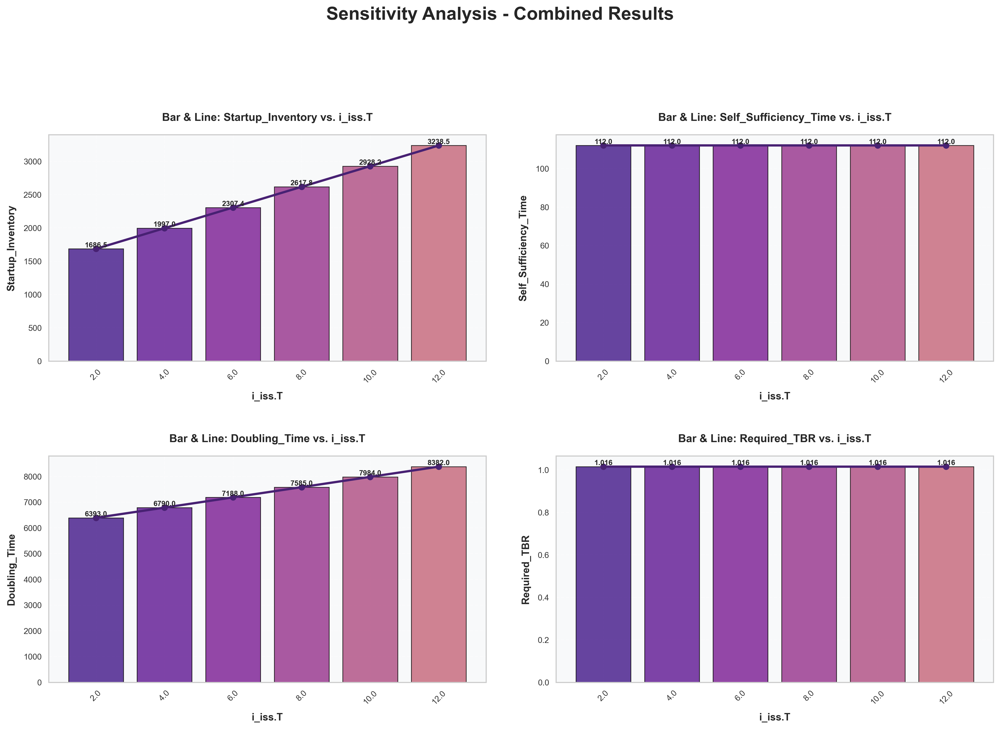

# SALib 敏感性分析报告

生成时间: 2025-09-25 16:58:24.418099

## 不同i_iss.T下Inventory随时间变化 的曲线图:

## 不同i_iss.T下首炉氚、自持时间、倍增时间变化，最小TBR 的柱状图/折线图:

## 相关指标的数据表:

|   i_iss.T |   Doubling_Time |   Self_Sufficiency_Time |   Startup_Inventory |   Required_TBR |   Required_Self_Sufficiency_Time |
|----------:|----------------:|------------------------:|--------------------:|---------------:|---------------------------------:|
|         2 |            6393 |                     112 |             1686.52 |        1.01562 |                             5655 |
|         4 |            6790 |                     112 |             1996.97 |        1.01562 |                             5655 |
|         6 |            7188 |                     112 |             2307.41 |        1.01562 |                             5655 |
|         8 |            7585 |                     112 |             2617.84 |        1.01562 |                             5655 |
|        10 |            7984 |                     112 |             2928.24 |        1.01562 |                             5655 |
|        12 |            8382 |                     112 |             3238.47 |        1.01562 |                             5655 |