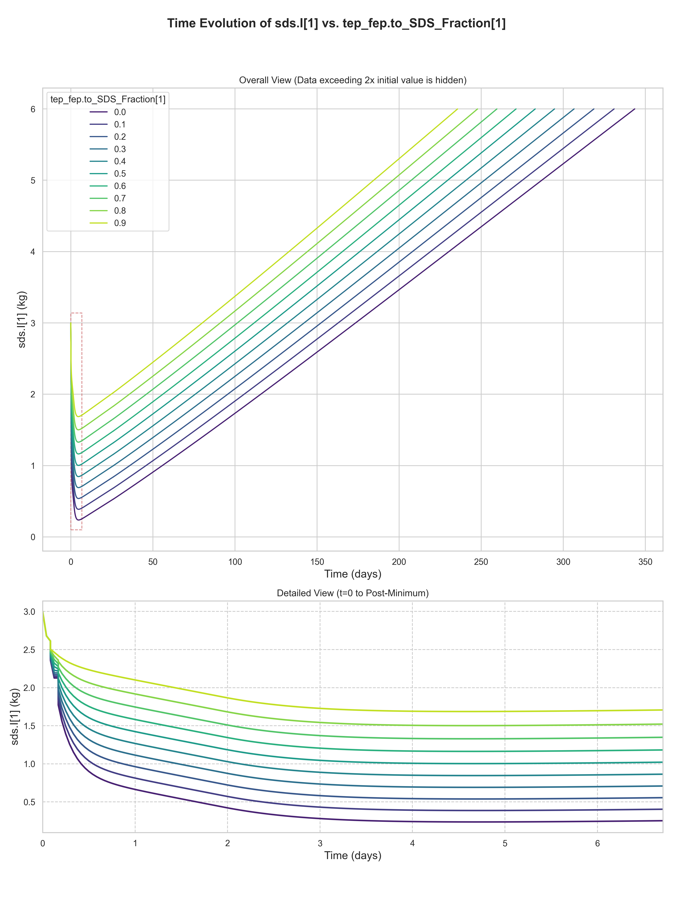
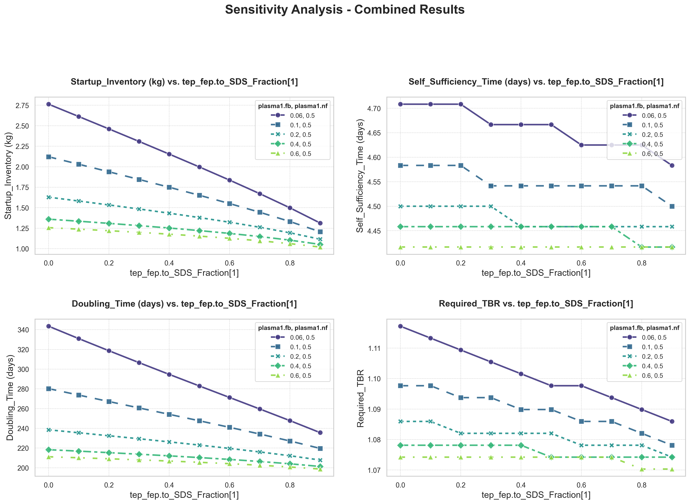

# tep_fep.to_SDS_Fraction[1] 敏感性分析报告

生成时间: 2025-10-16 09:33:13.935613

## 分析案例配置详情

本分析案例的具体配置如下，这决定了仿真的扫描方式和分析的重点：

| 配置项 | 值 | 说明 |
| :--- | :--- | :--- |
| **`name`** | `"DIR_Analysis"` | 本次分析案例的名称。 |
| **`independent_variable`** | `"tep_fep.to_SDS_Fraction[1]"` | 独立扫描变量，即本次分析中主要改变的参数。 |
| **`independent_variable_sampling`** | `"linspace:0:0.9:10"` | 独立变量的采样方法和范围。 |
| **`default_independent_values`** | `{"tep_fep.to_SDS_Fraction[1]": 0.5}` | 独立扫描变量在模型中的原始默认值。 |
| **`simulation_parameters`** | `{"plasma1.fb": [0.1, 0.2, 0.4, 0.6], "plasma1.nf": 0.5}` | 背景扫描参数，与独立变量组合形成多维扫描。 |
| **`default_simulation_values`** | `{"plasma1.fb": 0.06, "plasma1.nf": 0.5}` | 背景扫描参数在模型中的原始默认值。 |
| **`dependent_variables`** | `["Startup_Inventory", "Self_Sufficiency_Time", "Doubling_Time", "Required_TBR"]` | 因变量，即我们关心的、随自变量变化的性能指标。 |

## “所需氚增殖比”优化配置

当“所需氚增殖比” (`Required_TBR`) 作为因变量时，系统会启用一个二分查找算法来寻找满足特定性能指标的最小TBR值。以下是本次优化任务的具体配置：

| 配置项 | 值 | 说明 |
| :--- | :--- | :--- |
| **`parameter_to_optimize`** | `"blanket.TBR"` | 优化的目标参数。 |
| **`search_range`** | `[1.0, 1.5]` | 参数的搜索范围。 |
| **`tolerance`** | `0.005` | 搜索的收敛精度。 |
| **`max_iterations`** | `10` | 最大迭代次数。 |
| **`metric_name`** | `"Doubling_Time"` | 优化的目标性能指标。 |
| **`metric_source_column`** | `"sds.I[1]"` | 指标的数据源列。 |
| **`metric_max_value`** | `7000` | 目标指标需要满足的上限值。 |

## SDS Inventory 的时间曲线图:

## Startup Inventory、Self Sufficiency Time、Doubling Time、Required TBR 的趋势曲线图:

## 相关指标的数据表分组: `plasma1.fb`, `plasma1.nf`

#### 数据子表 (原始默认值: `plasma1.fb=0.06` & `plasma1.nf=0.5`)

|   tep_fep.to_SDS_Fraction[1] |   Startup_Inventory (gram) |   Self_Sufficiency_Time (day) |   Doubling_Time (day) |   Required_TBR |   Required_Doubling_Time (day) |
|-----------------------------:|---------------------------:|------------------------------:|----------------------:|---------------:|-------------------------------:|
|                          0   |                    2762.83 |                          4.71 |                343.54 |         1.1172 |                         282.25 |
|                          0.1 |                    2612.58 |                          4.71 |                330.96 |         1.1133 |                         283.92 |
|                          0.2 |                    2461.25 |                          4.71 |                318.67 |         1.1094 |                         285.67 |
|                          0.3 |                    2308.53 |                          4.67 |                306.58 |         1.1055 |                         287.46 |
|                          0.4 |                    2153.98 |                          4.67 |                294.67 |         1.1016 |                         289.25 |
|                          0.5 |                    1996.97 |                          4.67 |                282.92 |         1.0977 |                         291.04 |
|                          0.6 |                    1836.56 |                          4.62 |                271.25 |         1.0977 |                         278.96 |
|                          0.7 |                    1671.22 |                          4.62 |                259.58 |         1.0938 |                         279.96 |
|                          0.8 |                    1498.37 |                          4.62 |                247.79 |         1.0898 |                         280.58 |
|                          0.9 |                    1313.22 |                          4.58 |                235.62 |         1.0859 |                         280.5  |

---

> 其他参数组合下的数据子表：

#### 数据子表 (当 `plasma1.fb=0.1` & `plasma1.nf=0.5` 时)

|   tep_fep.to_SDS_Fraction[1] |   Startup_Inventory (gram) |   Self_Sufficiency_Time (day) |   Doubling_Time (day) |   Required_TBR |   Required_Doubling_Time (day) |
|-----------------------------:|---------------------------:|------------------------------:|----------------------:|---------------:|-------------------------------:|
|                          0   |                    2121.61 |                          4.58 |                280.25 |         1.0977 |                         288.08 |
|                          0.1 |                    2030.56 |                          4.58 |                273.71 |         1.0977 |                         281.29 |
|                          0.2 |                    1938.41 |                          4.58 |                267.17 |         1.0938 |                         287.79 |
|                          0.3 |                    1844.86 |                          4.54 |                260.67 |         1.0938 |                         280.67 |
|                          0.4 |                    1749.5  |                          4.54 |                254.17 |         1.0898 |                         287.17 |
|                          0.5 |                    1651.7  |                          4.54 |                247.62 |         1.0898 |                         279.54 |
|                          0.6 |                    1550.55 |                          4.54 |                241    |         1.0859 |                         285.88 |
|                          0.7 |                    1444.6  |                          4.54 |                234.21 |         1.0859 |                         277.54 |
|                          0.8 |                    1331.41 |                          4.54 |                227.17 |         1.082  |                         283.29 |
|                          0.9 |                    1206.59 |                          4.5  |                219.62 |         1.0781 |                         288.83 |

#### 数据子表 (当 `plasma1.fb=0.2` & `plasma1.nf=0.5` 时)

|   tep_fep.to_SDS_Fraction[1] |   Startup_Inventory (gram) |   Self_Sufficiency_Time (day) |   Doubling_Time (day) |   Required_TBR |   Required_Doubling_Time (day) |
|-----------------------------:|---------------------------:|------------------------------:|----------------------:|---------------:|-------------------------------:|
|                          0   |                    1628.69 |                          4.5  |                238.5  |         1.0859 |                         281.88 |
|                          0.1 |                    1581.81 |                          4.5  |                235.5  |         1.0859 |                         278.21 |
|                          0.2 |                    1533.82 |                          4.5  |                232.46 |         1.082  |                         288.96 |
|                          0.3 |                    1484.45 |                          4.5  |                229.42 |         1.082  |                         284.96 |
|                          0.4 |                    1433.28 |                          4.46 |                226.25 |         1.082  |                         280.83 |
|                          0.5 |                    1379.75 |                          4.46 |                223    |         1.082  |                         276.62 |
|                          0.6 |                    1323.02 |                          4.46 |                219.62 |         1.0781 |                         287.21 |
|                          0.7 |                    1261.79 |                          4.46 |                216.04 |         1.0781 |                         282.29 |
|                          0.8 |                    1193.98 |                          4.46 |                212.21 |         1.0781 |                         276.96 |
|                          0.9 |                    1115.94 |                          4.46 |                207.83 |         1.0742 |                         286.62 |

#### 数据子表 (当 `plasma1.fb=0.4` & `plasma1.nf=0.5` 时)

|   tep_fep.to_SDS_Fraction[1] |   Startup_Inventory (gram) |   Self_Sufficiency_Time (day) |   Doubling_Time (day) |   Required_TBR |   Required_Doubling_Time (day) |
|-----------------------------:|---------------------------:|------------------------------:|----------------------:|---------------:|-------------------------------:|
|                          0   |                    1360.36 |                          4.46 |                218.33 |         1.0781 |                         284.54 |
|                          0.1 |                    1335.28 |                          4.46 |                216.88 |         1.0781 |                         282.54 |
|                          0.2 |                    1309.11 |                          4.46 |                215.33 |         1.0781 |                         280.46 |
|                          0.3 |                    1281.58 |                          4.46 |                213.75 |         1.0781 |                         278.29 |
|                          0.4 |                    1252.34 |                          4.46 |                212.08 |         1.0781 |                         276.04 |
|                          0.5 |                    1220.9  |                          4.46 |                210.33 |         1.0742 |                         289.17 |
|                          0.6 |                    1186.55 |                          4.46 |                208.46 |         1.0742 |                         286.42 |
|                          0.7 |                    1148.26 |                          4.46 |                206.38 |         1.0742 |                         283.46 |
|                          0.8 |                    1104.42 |                          4.42 |                204.04 |         1.0742 |                         280.12 |
|                          0.9 |                    1052.43 |                          4.42 |                201.33 |         1.0742 |                         276.29 |

#### 数据子表 (当 `plasma1.fb=0.6` & `plasma1.nf=0.5` 时)

|   tep_fep.to_SDS_Fraction[1] |   Startup_Inventory (gram) |   Self_Sufficiency_Time (day) |   Doubling_Time (day) |   Required_TBR |   Required_Doubling_Time (day) |
|-----------------------------:|---------------------------:|------------------------------:|----------------------:|---------------:|-------------------------------:|
|                          0   |                    1256.62 |                          4.42 |                211.17 |         1.0742 |                         290    |
|                          0.1 |                    1238.69 |                          4.42 |                210.17 |         1.0742 |                         288.54 |
|                          0.2 |                    1219.7  |                          4.42 |                209.12 |         1.0742 |                         287    |
|                          0.3 |                    1199.4  |                          4.42 |                208    |         1.0742 |                         285.42 |
|                          0.4 |                    1177.48 |                          4.42 |                206.83 |         1.0742 |                         283.71 |
|                          0.5 |                    1153.51 |                          4.42 |                205.54 |         1.0742 |                         281.88 |
|                          0.6 |                    1126.89 |                          4.42 |                204.17 |         1.0742 |                         279.88 |
|                          0.7 |                    1096.75 |                          4.42 |                202.58 |         1.0742 |                         277.67 |
|                          0.8 |                    1061.82 |                          4.42 |                200.79 |         1.0703 |                         291.46 |
|                          0.9 |                    1020.11 |                          4.42 |                198.71 |         1.0703 |                         288.33 |

