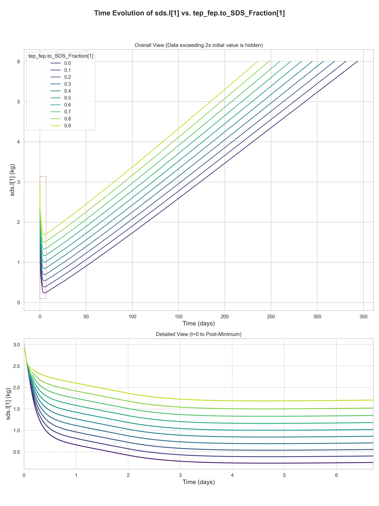
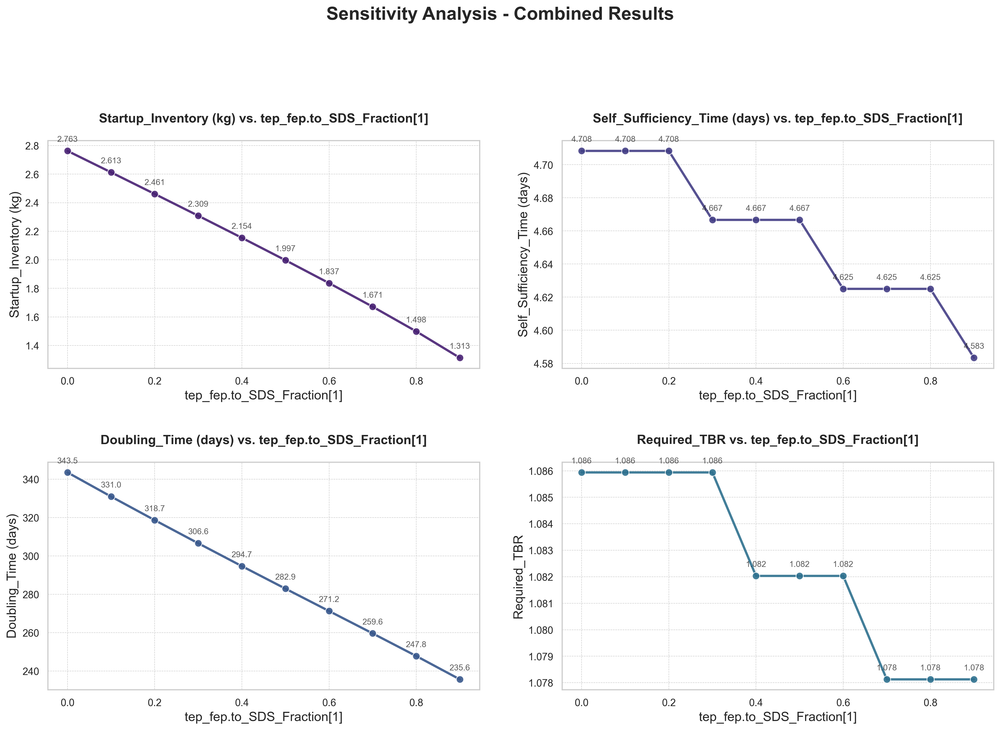

# tep_fep.to_SDS_Fraction[1] 敏感性分析报告

生成时间: 2025-10-16 09:59:55.121828

## 分析案例配置详情

本分析案例的具体配置如下，这决定了仿真的扫描方式和分析的重点：

| 配置项 | 值 | 说明 |
| :--- | :--- | :--- |
| **`name`** | `"DIR_Analysis"` | 本次分析案例的名称。 |
| **`independent_variable`** | `"tep_fep.to_SDS_Fraction[1]"` | 独立扫描变量，即本次分析中主要改变的参数。 |
| **`independent_variable_sampling`** | `"linspace:0:0.9:10"` | 独立变量的采样方法和范围。 |
| **`default_independent_values`** | `{"tep_fep.to_SDS_Fraction[1]": 0.5}` | 独立扫描变量在模型中的原始默认值。 |
| **`dependent_variables`** | `["Startup_Inventory", "Self_Sufficiency_Time", "Doubling_Time", "Required_TBR"]` | 因变量，即我们关心的、随自变量变化的性能指标。 |

## “所需氚增殖比”优化配置

当“所需氚增殖比” (`Required_TBR`) 作为因变量时，系统会启用一个二分查找算法来寻找满足特定性能指标的最小TBR值。以下是本次优化任务的具体配置：

| 配置项 | 值 | 说明 |
| :--- | :--- | :--- |
| **`parameter_to_optimize`** | `"blanket.TBR"` | 优化的目标参数。 |
| **`search_range`** | `[1.0, 1.5]` | 参数的搜索范围。 |
| **`tolerance`** | `0.005` | 搜索的收敛精度。 |
| **`max_iterations`** | `10` | 最大迭代次数。 |
| **`metric_name`** | `"Self_Sufficiency_Time"` | 优化的目标性能指标。 |
| **`metric_source_column`** | `"sds.I[1]"` | 指标的数据源列。 |
| **`metric_max_value`** | `120` | 目标指标需要满足的上限值。 |

## SDS Inventory 的时间曲线图:

## Startup Inventory、Self Sufficiency Time、Doubling Time、Required TBR 的趋势曲线图:

## 相关指标的数据表:

|   tep_fep.to_SDS_Fraction[1] |   Startup_Inventory (gram) |   Self_Sufficiency_Time (day) |   Doubling_Time (day) |   Required_TBR |   Required_Self_Sufficiency_Time (day) |
|-----------------------------:|---------------------------:|------------------------------:|----------------------:|---------------:|---------------------------------------:|
|                          0   |                    2762.83 |                          4.71 |                343.54 |         1.0859 |                                   4.96 |
|                          0.1 |                    2612.58 |                          4.71 |                330.96 |         1.0859 |                                   4.96 |
|                          0.2 |                    2461.25 |                          4.71 |                318.67 |         1.0859 |                                   4.92 |
|                          0.3 |                    2308.53 |                          4.67 |                306.58 |         1.0859 |                                   4.92 |
|                          0.4 |                    2153.98 |                          4.67 |                294.67 |         1.082  |                                   4.96 |
|                          0.5 |                    1996.97 |                          4.67 |                282.92 |         1.082  |                                   4.96 |
|                          0.6 |                    1836.56 |                          4.62 |                271.25 |         1.082  |                                   4.92 |
|                          0.7 |                    1671.22 |                          4.62 |                259.58 |         1.0781 |                                   4.96 |
|                          0.8 |                    1498.37 |                          4.62 |                247.79 |         1.0781 |                                   4.96 |
|                          0.9 |                    1313.22 |                          4.58 |                235.62 |         1.0781 |                                   4.96 |