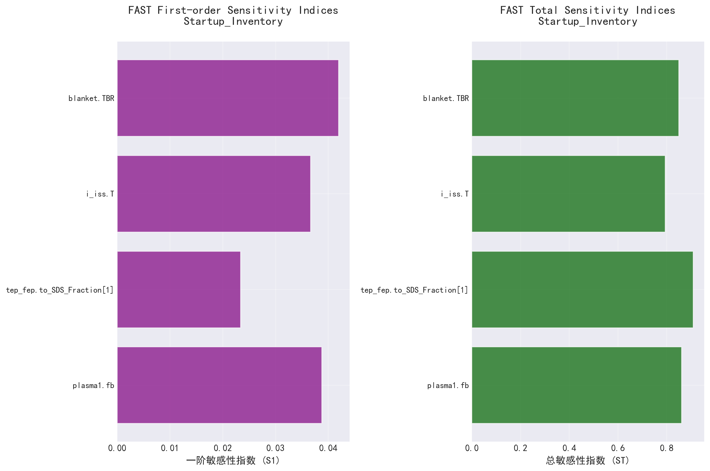
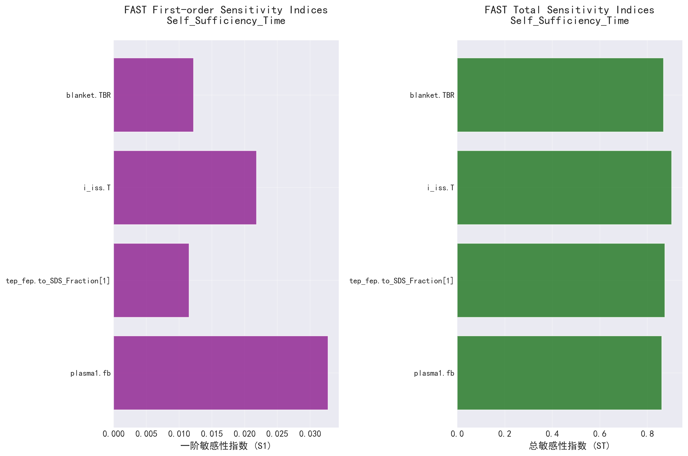
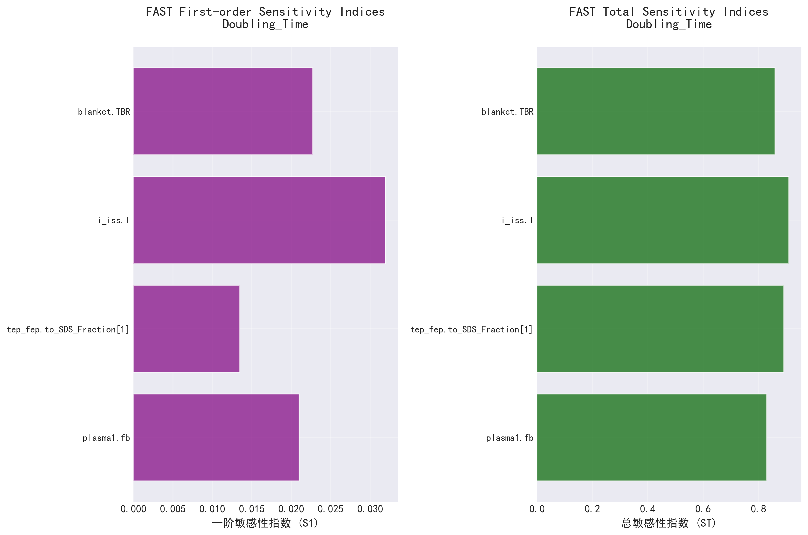

# SALib 敏感性分析报告

生成时间: 2025-09-25 17:12:17.522020

## 分析参数

- **plasma1.fb**: [0.0200, 0.2000]
- **tep_fep.to_SDS_Fraction[1]**: [0.1000, 0.9900]
- **i_iss.T**: [4.0000, 12.0000]
- **blanket.TBR**: [1.0500, 1.2500]

## Startup_Inventory 敏感性分析结果

### FAST敏感性指数

| 参数 | S1 (一阶) | ST (总) |
|------|----------|---------|
| plasma1.fb | 0.0388 | 0.8613 |
| tep_fep.to_SDS_Fraction[1] | 0.0234 | 0.9086 |
| i_iss.T | 0.0366 | 0.7940 |
| blanket.TBR | 0.0419 | 0.8495 |

## Self_Sufficiency_Time 敏感性分析结果

### FAST敏感性指数

| 参数 | S1 (一阶) | ST (总) |
|------|----------|---------|
| plasma1.fb | 0.0327 | 0.8608 |
| tep_fep.to_SDS_Fraction[1] | 0.0115 | 0.8737 |
| i_iss.T | 0.0218 | 0.9020 |
| blanket.TBR | 0.0122 | 0.8678 |

## Doubling_Time 敏感性分析结果

### FAST敏感性指数

| 参数 | S1 (一阶) | ST (总) |
|------|----------|---------|
| plasma1.fb | 0.0210 | 0.8301 |
| tep_fep.to_SDS_Fraction[1] | 0.0135 | 0.8914 |
| i_iss.T | 0.0319 | 0.9095 |
| blanket.TBR | 0.0227 | 0.8595 |

