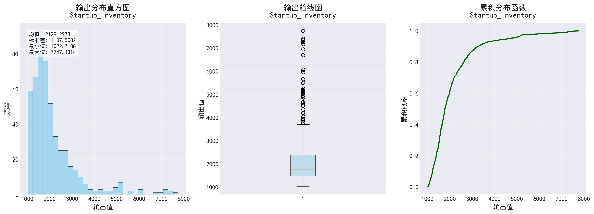
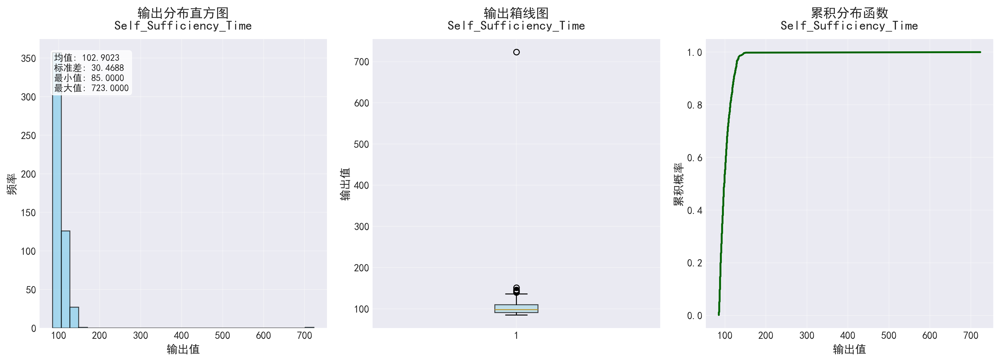
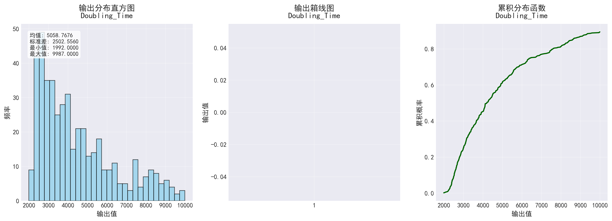

# SALib 敏感性分析报告

生成时间: 2025-09-25 17:00:46.348546

## 分析参数

- **plasma1.fb**: [0.0200, 0.2000]
- **tep_fep.to_SDS_Fraction[1]**: [0.1000, 0.9900]
- **i_iss.T**: [4.0000, 12.0000]
- **blanket.TBR**: [1.0500, 1.2500]

## Startup_Inventory 敏感性分析结果

- 均值: 2129.2978
- 标准差: 1107.5082
- 最小值: 1022.7188
- 最大值: 7747.4314
- 5%分位数: 1143.9033
- 95%分位数: 4599.0115

## Self_Sufficiency_Time 敏感性分析结果

- 均值: 102.9023
- 标准差: 30.4688
- 最小值: 85.0000
- 最大值: 723.0000
- 5%分位数: 86.5500
- 95%分位数: 128.0000

## Doubling_Time 敏感性分析结果

- 均值: 5058.7676
- 标准差: 2502.5560
- 最小值: 1992.0000
- 最大值: 9987.0000
- 5%分位数: 2394.0000
- 95%分位数: 9987.0000

