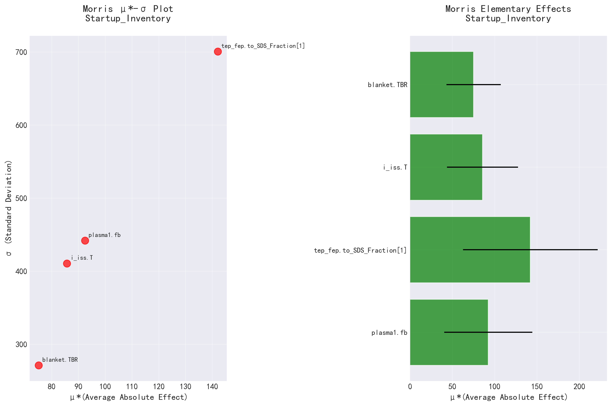
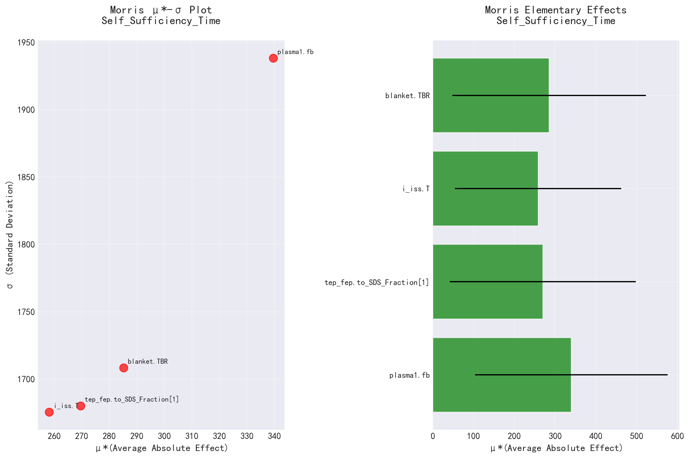
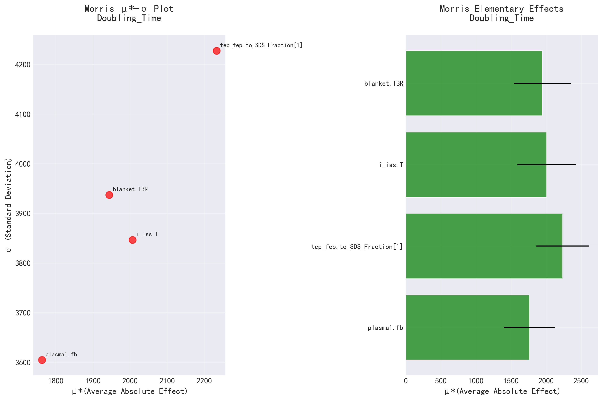

# SALib 敏感性分析报告

生成时间: 2025-09-25 17:03:46.850097

## 分析参数

- **plasma1.fb**: [0.0200, 0.2000]
- **tep_fep.to_SDS_Fraction[1]**: [0.1000, 0.9900]
- **i_iss.T**: [4.0000, 12.0000]
- **blanket.TBR**: [1.0500, 1.2500]

## Startup_Inventory 敏感性分析结果

### Morris敏感性指数

| 参数 | μ* (平均绝对效应) | σ (标准差) | μ*置信区间 |
|------|-------------------|------------|------------|
| plasma1.fb | 92.3952 | 441.9268 | ±51.9985 |
| tep_fep.to_SDS_Fraction[1] | 142.0201 | 700.6533 | ±79.4564 |
| i_iss.T | 85.6532 | 410.6040 | ±41.8765 |
| blanket.TBR | 75.1104 | 271.1354 | ±32.1354 |

## Self_Sufficiency_Time 敏感性分析结果

### Morris敏感性指数

| 参数 | μ* (平均绝对效应) | σ (标准差) | μ*置信区间 |
|------|-------------------|------------|------------|
| plasma1.fb | 339.6035 | 1938.2344 | ±236.0833 |
| tep_fep.to_SDS_Fraction[1] | 269.6426 | 1680.1841 | ±228.1575 |
| i_iss.T | 258.2051 | 1675.4923 | ±203.8099 |
| blanket.TBR | 285.2285 | 1708.3407 | ±237.2608 |

## Doubling_Time 敏感性分析结果

### Morris敏感性指数

| 参数 | μ* (平均绝对效应) | σ (标准差) | μ*置信区间 |
|------|-------------------|------------|------------|
| plasma1.fb | 1762.2773 | 3604.8765 | ±368.6870 |
| tep_fep.to_SDS_Fraction[1] | 2233.2070 | 4227.7558 | ±374.9651 |
| i_iss.T | 2006.5664 | 3846.8131 | ±416.6595 |
| blanket.TBR | 1944.0059 | 3937.5013 | ±407.0065 |

