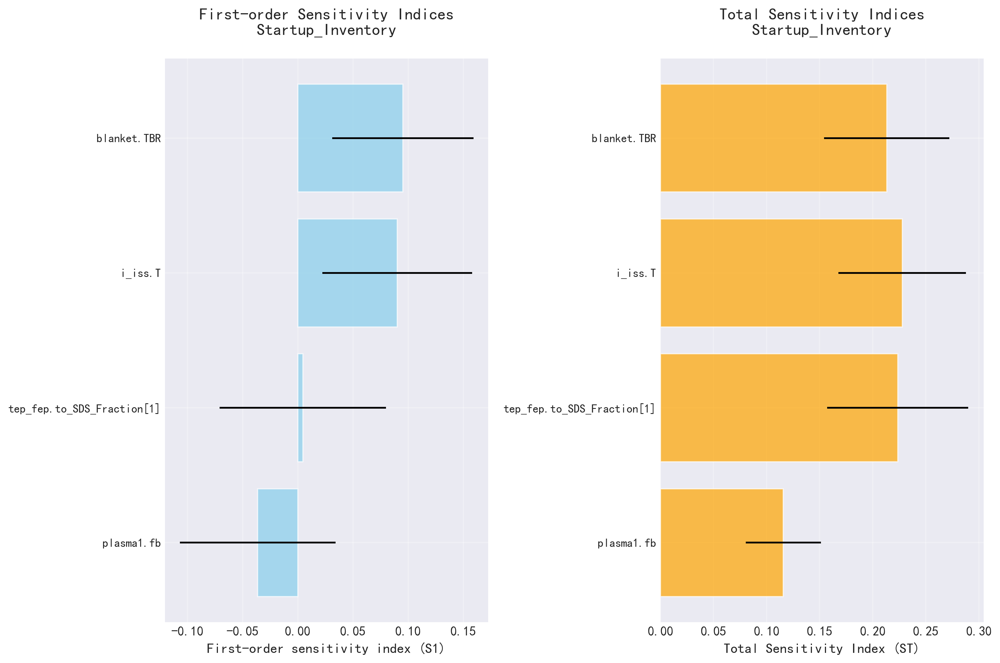
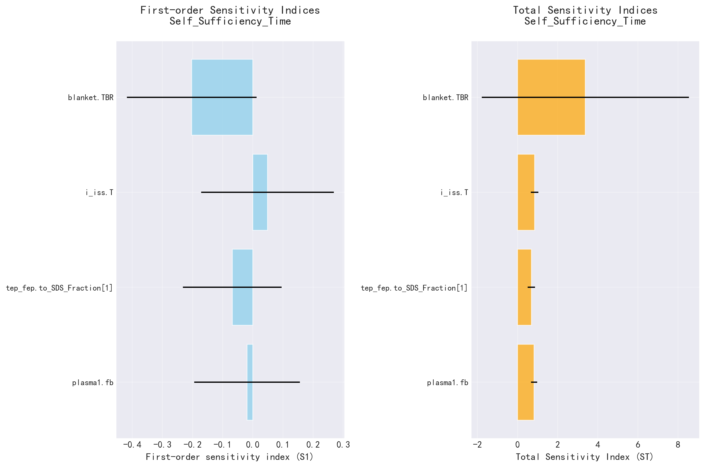
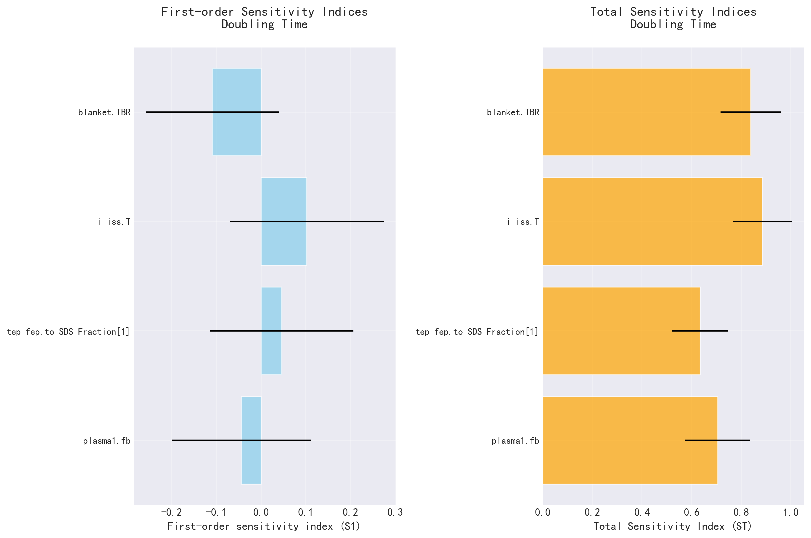

# SALib 敏感性分析报告

生成时间: 2025-09-25 17:09:30.971150

## 分析参数

- **plasma1.fb**: [0.0200, 0.2000]
- **tep_fep.to_SDS_Fraction[1]**: [0.1000, 0.9900]
- **i_iss.T**: [4.0000, 12.0000]
- **blanket.TBR**: [1.0500, 1.2500]

## Startup_Inventory 敏感性分析结果

### Sobol敏感性指数

| 参数 | S1 (一阶) | ST (总) | S1置信区间 | ST置信区间 |
|------|----------|---------|------------|------------|
| plasma1.fb | -0.0363 | 0.1158 | ±0.0706 | ±0.0354 |
| tep_fep.to_SDS_Fraction[1] | 0.0046 | 0.2236 | ±0.0754 | ±0.0664 |
| i_iss.T | 0.0903 | 0.2278 | ±0.0678 | ±0.0600 |
| blanket.TBR | 0.0952 | 0.2132 | ±0.0641 | ±0.0590 |

## Self_Sufficiency_Time 敏感性分析结果

### Sobol敏感性指数

| 参数 | S1 (一阶) | ST (总) | S1置信区间 | ST置信区间 |
|------|----------|---------|------------|------------|
| plasma1.fb | -0.0192 | 0.8273 | ±0.1754 | ±0.1552 |
| tep_fep.to_SDS_Fraction[1] | -0.0682 | 0.6905 | ±0.1637 | ±0.1802 |
| i_iss.T | 0.0487 | 0.8519 | ±0.2204 | ±0.1842 |
| blanket.TBR | -0.2028 | 3.3800 | ±0.2154 | ±5.1621 |

## Doubling_Time 敏感性分析结果

### Sobol敏感性指数

| 参数 | S1 (一阶) | ST (总) | S1置信区间 | ST置信区间 |
|------|----------|---------|------------|------------|
| plasma1.fb | -0.0439 | 0.7051 | ±0.1550 | ±0.1305 |
| tep_fep.to_SDS_Fraction[1] | 0.0462 | 0.6345 | ±0.1604 | ±0.1126 |
| i_iss.T | 0.1023 | 0.8844 | ±0.1719 | ±0.1193 |
| blanket.TBR | -0.1089 | 0.8379 | ±0.1486 | ±0.1214 |

